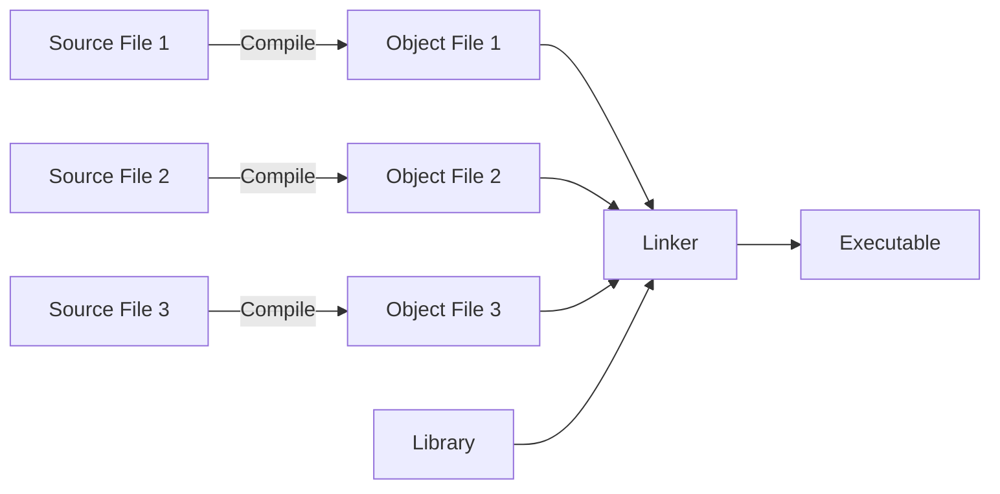
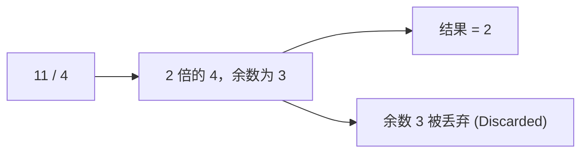
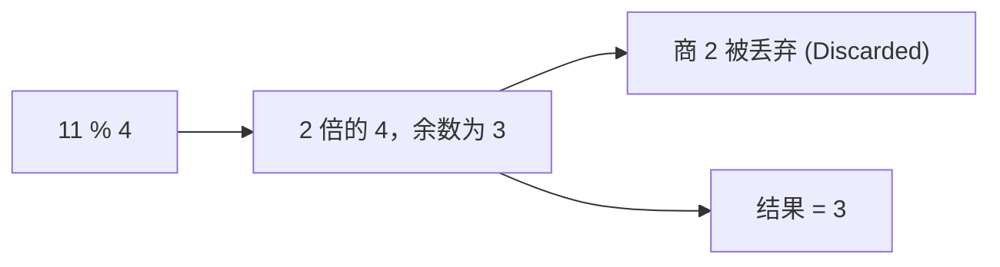

## **目录**

- [Chapter 1](#chapter-1)
  - [Data Input and Output](#data-input-and-output)
  - [Code Appearance](#code-appearance)
  - [Code Programming](#code-programming)
  - [Procedural and Object-Oriented Programming](#procedural-and-object-oriented-programming)
  - [Represent Numbers](#represent-numbers)
  - [Big-Endian and Little-Endian Systems](#big-endian-and-little-endian-systems)
  - [Representing Characters](#representing-characters)
  - [C++ Source Characters](#c-source-characters)
  - [Escape Sequence](#escape-sequence)
- [Chapter 2: Introducing Fundamental Types of Data](#chapter-2-introducing-fundamental-types-of-data)
  - [Variables, Data, and Data Types](#variables-data-and-data-types)
  - [Signed Integer Types](#signed-integer-types)
  - [Unsigned Types](#unsigned-types)
  - [Zero Initialization](#zero-initialization)
  - [Defining Variables with Fixed Values](#defining-variables-with-fixed-values)
  - [Integer Literals](#integer-literals)
  - [Calculations with Integers](#calculations-with-integers)
  - [Compound Arithmetic Expressions](#compound-arithmetic-expressions)
  - [Assignment Operations](#assignment-operations)
  - [The op= Assignment Operators](#the-op-assignment-operators)
  - [The `sizeof` Operator](#the-sizeof-operator)
  - [Incrementing and Decrementing Integers](#incrementing-and-decrementing-integers)
  - [Postfix Increment and Decrement Operations](#postfix-increment-and-decrement-operations)
  - [Defining Floating-Point Variables](#defining-floating-point-variables)
  - [Floating-Point Literals](#floating-point-literals)
  - [Floating-Point Calculations](#floating-point-calculations)
  - [Mathematical Functions](#mathematical-functions)
  - [Invalid Floating-Point Results](#invalid-floating-point-results)
  - [Pitfalls](#pitfalls)
  - [Mixed Expressions and Type](#mixed-expressions-and-type)
  - [Explicit Cast (explicit type conversion)](#explicit-cast-explicit-type-conversion)
  - [Formatting Stream Output](#formatting-stream-output)
  - [String Formatting with `std::format()`](#string-formatting-with-stdformat)
  - [Format Specifiers](#format-specifiers)
  - [Formatting Tabular Data](#formatting-tabular-data)
  - [Formatting Numbers](#formatting-numbers)
  - [Argument Indexes](#argument-indexes)
  - [Finding the Limits](#finding-the-limits)
  - [Finding Other Properties of Fundamental Types](#finding-other-properties-of-fundamental-types)
  - [Working with Character Variables](#working-with-character-variables)
  - [Working with Unicode Characters](#working-with-unicode-characters)
  - [The `auto` Keyword](#the-auto-keyword)
  - [Exercise](#exercise)
 
<a id="Chapter1"></a>

# Chapter 1
<a id="DataInputAndOutput"></a>

## Data Input and Output

- Stream的概念: Stream 是数据源或数据槽的抽象表示. <br>
- 使用 Stream 的优点: 可以在不同设备上保持代码语法的一致性, 从而降低编程复杂度. <br>
- 当你的程序执行时，每个流都会绑定到一个特定的设备上，对于 Input  Stream 来说，该设备是数据的来源;
  而对于 Output Stream 来说，该设备是数据的目标。<br>
- `Input` 和 `Output` 在C++中用 **stream** 表示，若输出数据，则写入 Output Stream，若输入数据，则从 Input Output 中读取。<br>
  C++中的 O Stream: `std::cout`(详见 Chapter 2).
  C++中的 I Stream: `std::cin` (详见 Chapter 2).
:::tip
  被输出的数据会先储存 Output Buffer 当中, 使用 `std::endl` 后, **会创建一个新行继续写入, 并刷新 Output Buffer**, 
  刷新 Output Buffer 可以保证输出快速呈现, 但在多次连续输出时, 请避免使用 std::endl, 频繁刷新会导致输出缓慢, 
  你应该使用 `\n`.
:::
<a id="CodeAppearance"></a>

## Code Appearance
```cpp
// Google C++ Style Guide
class MyClass {
 public:
  void DoSomething(int value) {
    if (value > 0) {
      result_ = value;
    }
  }

 private:
  int result_;
};
// LLVM Coding Standards
class MyClass {
public:
  void doSomething(int Value) {
    if (Value <= 0)
      return;
    Result = Value;
  }

private:
  int Result;
};
// Microsoft C++ Style (Windows)
class MyClass
{
public:
    void DoSomething(int value)
    {
        if (value > 0)
        {
            m_result = value;
        }
    }

private:
    int m_result;
};
```
<a id="CodeProgramming"></a>

## Code Programming


<a id="ProceduralAndObject-OrientedProgramming"></a>

## Procedural and Object-Oriented Programming

- **Procedural Programming:** <br>
  数据与操作分离, 将整个流程分为可操作计算单元, 通常是**函数**; <br>
  数据储存在数组或结构体中, 通过**参数**或**全局变量**传递.<br>

:::tip
  对于一开始就对问题有清晰的认识, 如算法类任务, 经常使用面向过程编程, 直观, 易调试. 但在需求复杂, 状态多变时, 维护成本会上升.
:::

- **Object-Oriented Programming** <br>
  将你想要处理的数据封装在类中, 如创建一个 Student 类, 包含的数据有Age, Grade等. <br>
  规定新的数据类型允许的操作, 如运算符重载 <br>

:::tip
  面向对象的编程可以使**对象内部细节对外隐藏,** 调用者只需通过接口与之交互，从而降低耦合、提升**可扩展性**, 
  适合大型项目或多人合作. 但设计成本较高.
:::

- 举个例子, 有一个大箱子, 我们要让它装三个小箱子, Procedural Programming 要让我们清楚小箱子的大小, 并计算出创建的大箱子应有多大, 
  而 Object-Oriented Programming 会定义一个箱子类型, 接着定义一个操作将小箱子相加, 就是大箱子的大小.

<a id="RepresentNumbers"></a>

## Represent Numbers

Hexadecimal Digits and Their Values in Decimal and Binary

| Hexadecimal | Decimal | Binary |
| --- | --- | --- |
| 0 | 0 | 0000 |
| 1 | 1 | 0001 |
| 2 | 2 | 0010 |
| 3 | 3 | 0011 |
| 4 | 4 | 0100 |
| 5 | 5 | 0101 |
| 6 | 6 | 0110 |
| 7 | 7 | 0111 |
| 8 | 8 | 1000 |
| 9 | 9 | 1001 |
| A or a | 10 | 1010 |
| B or b | 11 | 1011 |
| C or c | 12 | 1100 |
| D or d | 13 | 1101 |
| E or e | 14 | 1110 |
| F or f | 15 | 1111 |

- **hexadecimal 与 binary 转换:** 将 binary 每四位替换为对应的 hex 数字 <br>
- **Sign-Magnitude, One’s Complement and Two’s Complement** <br>
  **反码One'sComplement:** 正数的反码与原码相同, 负数反码为符号位不变, 数值位取反. <br>
  **补码Two's Compement:** 正数的补码与原码相同, 负数补码为原码加 1. <br>
- **负数:** 计算 -3 时, 先取 +3 原码, 接着数值位取反并加 1, 得到 -3 的补码, 这即为 -3 在 binary 中表示.
- **加减计算:** 将补码相加, 溢出位舍弃. (应该从右往左)
:::tip[补码的优势]
  1. 补码允许使用相同的电路进行加减法运算
  2. 避免正负 0
  3. 有效利用储存空间
:::

:::caution
  **Octal Values:** 在写十进制数字的时候不要以 0 开头, 这表示的是八进制数字.
:::
<a id="BigEndianAndLittleEndianSystems"></a>

## Big-Endian and Little-Endian Systems

- **Little-Endian:** 
```markdown
Byte address: 00 01 02 03
Data bits: 00000011 00000010 00000001 00000000
```
  从高地址向低地址排序.

- **Big-Endian:** 
```markdown
Byte address: 00 01 02 03
Data bits: 00000000 00000001 00000010 00000011
```
  从低地址向高地址排序.

- **Bi-Endian:** <br>
  几乎所有的 ARM 处理器都是 Bi-Endian, 即大小端可配置.

:::tip
  1. 无论是大端字节序还是小端字节序, 在字节内部都是从左到右排序的.
  2. 在 C++20 中, 你可以使用 `std::endian::native` 来确定你的程序编译方式是大端还是小端, 它包含在 `<bit>` 模块中,<br>
    它的返回值是 `std::endian::little` 或 `std::endian::big`.
:::
<a id="RepresentingCharacters"></a>

## Representing Characters

  每个字符被指定为一个整数, 这个整数叫做它的 code 或 code point. <br>

**ASCII:** American Standard Code for Information Interchange(解释). <br>
  这是一个 7-bit 代码, 所以有 128 种不同代码值: <br>
  `0 ~ 31`: 非打印字符, 如 `carriage return` (code 15);<br>
  `65 ~ 90`: 大写字母 `A ~ Z`; <br>
  `97 ~ 122`: 小写字母 `a ~ z`; <br>

<details>
<summary>ASCII 列表</summary>

| 二进制 | 八进制 | 十进制 | 十六进制 | 字符/缩写 |	解释 |
| --- | --- | --- | --- | --- | --- |
| 00000000 | 000 | 0 | 00 | NUL (NULL) | 空字符 |
| 00000001 | 001 | 1 | 01 | SOH (Start Of Headling) | 标题开始 |
| 00000010 | 002 | 2 | 02 | STX (Start Of Text)	| 正文开始 |
| 00000011 | 003 | 3 | 03 | ETX (End Of Text) | 正文结束 |
| 00000100 | 004 | 4 | 04 | EOT (End Of Transmission) | 传输结束 |
| 00000101 | 005 | 5 | 05 | ENQ (Enquiry) | 请求 |
| 00000110 | 006 | 6 | 06 | ACK (Acknowledge) | 回应/响应/收到通知 |
| 00000111 | 007 | 7 | 07 | BEL (Bell) | 响铃 |
| 00001000 | 010 | 8 | 08 | BS (Backspace) | 退格 |
| 00001001 | 011 | 9 | 09 | HT (Horizontal Tab) | 水平制表符 |
| 00001010 | 012 | 10 | 0A | LF/NL (Line Feed/New Line) | 换行键 |
| 00001011 | 013 | 11 | 0B | VT (Vertical Tab) | 垂直制表符 |
| 00001100 | 014 | 12 | 0C | FF/NP (Form Feed/New Page) | 换页键 |
| 00001101 | 015 | 13 | 0D | CR (Carriage Return) | 回车键 |
| 00001110 | 016 | 14 | 0E | SO (Shift Out)	| 不用切换 |
| 00001111 | 017 | 15 | 0F | SI (Shift In) | 启用切换 |
| 00010000 | 020 | 16 | 10 | DLE (Data Link Escape)	| 数据链路转义 |
| 00010001 | 021 | 17 | 11 | DC1/XON <br> (Device Control 1 / Transmission On) | 设备控制1/传输开始 |
| 00010010 | 022 | 18 | 12 | DC2 (Device Control 2) | 设备控制2 |
| 00010011 | 023 | 19 | 13 | DC3/XOFF <br> (Device Control 3 / Transmission Off) | 设备控制3/传输中断 |
| 00010100 | 024 | 20 | 14 | DC4 (Device Control 4)	| 设备控制4 |
| 00010101 | 025 | 21 | 15 | NAK (Negative Acknowledge) | 无响应/非正常响应/拒绝接收 |
| 00010110 | 026 | 22 | 16 | SYN (Synchronous Idle)	| 同步空闲 |
| 00010111 | 027 | 23 | 17 | ETB (End of Transmission Block) | 传输块结束/块传输终止 |
| 00011000 | 030 | 24 | 18 | CAN (Cancel) | 取消 |
| 00011001 | 031 | 25 | 19 | EM (End of Medium) | 已到介质末端/介质存储已满/介质中断 |
| 00011010 | 032 | 26 | 1A | SUB (Substitute) | 替补/替换 |
| 00011011 | 033 | 27 | 1B | ESC (Escape) | 逃离/取消 |
| 00011100 | 034 | 28 | 1C | FS (File Separator) | 文件分割符 |
| 00011101 | 035 | 29 | 1D | GS (Group Separator) | 组分隔符/分组符 |
| 00011110 | 036 | 30 | 1E | RS (Record Separator) | 记录分离符 |
| 00011111 | 037 | 31 | 1F | US (Unit Separator) | 单元分隔符 |
| 00100000 | 040 | 32 | 20 | (Space) | 空格 |
| 00100001 | 041 | 33 | 21 | ! |	 
| 00100010 | 042 | 34 | 22 | " |	 
| 00100011 | 043 | 35 | 23 | # |	 
| 00100100 | 044 | 36 | 24 | $ |	 
| 00100101 | 045 | 37 | 25 | % |	 
| 00100110 | 046 | 38 | 26 | & |	 
| 00100111 | 047 | 39 | 27 | ' |	 
| 00101000 | 050 | 40 | 28 | ( |	 
| 00101001 | 051 | 41 | 29 | ) |	 
| 00101010 | 052 | 42 | 2A | * |	 
| 00101011 | 053 | 43 | 2B | + |	 
| 00101100 | 054 | 44 | 2C | , |	 
| 00101101 | 055 | 45 | 2D | - |	 
| 00101110 | 056 | 46 | 2E | . |	 
| 00101111 | 057 | 47 | 2F | / |	 
| 00110000 | 060 | 48 | 30 | 0 |	 
| 00110001 | 061 | 49 | 31 | 1 |	 
| 00110010 | 062 | 50 | 32 | 2 |	 
| 00110011 | 063 | 51 | 33 | 3 |	 
| 00110100 | 064 | 52 | 34 | 4 |	 
| 00110101 | 065 | 53 | 35 | 5 |	 
| 00110110 | 066 | 54 | 36 | 6 |	 
| 00110111 | 067 | 55 | 37 | 7 |	 
| 00111000 | 070 | 56 | 38 | 8 |	 
| 00111001 | 071 | 57 | 39 | 9 |	 
| 00111010 | 072 | 58 | 3A | : |	 
| 00111011 | 073 | 59 | 3B | ; |	 
| 00111100 | 074 | 60 | 3C | < |	 
| 00111101 | 075 | 61 | 3D | = |	 
| 00111110 | 076 | 62 | 3E | > |	 
| 00111111 | 077 | 63 | 3F | ? |	 
| 01000000 | 100 | 64 | 40 | @ |	 
| 01000001 | 101 | 65 | 41 | A |	 
| 01000010 | 102 | 66 | 42 | B |	 
| 01000011 | 103 | 67 | 43 | C |	 
| 01000100 | 104 | 68 | 44 | D |	 
| 01000101 | 105 | 69 | 45 | E |	 
| 01000110 | 106 | 70 | 46 | F |	 
| 01000111 | 107 | 71 | 47 | G |	 
| 01001000 | 110 | 72 | 48 | H |	 
| 01001001 | 111 | 73 | 49 | I |	 
| 01001010 | 112 | 74 | 4A | J |	 
| 01001011 | 113 | 75 | 4B | K |	 
| 01001100 | 114 | 76 | 4C | L |	 
| 01001101 | 115 | 77 | 4D | M |	 
| 01001110 | 116 | 78 | 4E | N |	 
| 01001111 | 117 | 79 | 4F | O |	 
| 01010000 | 120 | 80 | 50 | P |	 
| 01010001 | 121 | 81 | 51 | Q |	 
| 01010010 | 122 | 82 | 52 | R |	 
| 01010011 | 123 | 83 | 53 | S |	 
| 01010100 | 124 | 84 | 54 | T |	 
| 01010101 | 125 | 85 | 55 | U |	 
| 01010110 | 126 | 86 | 56 | V |	 
| 01010111 | 127 | 87 | 57 | W |	 
| 01011000 | 130 | 88 | 58 | X |	 
| 01011001 | 131 | 89 | 59 | Y |	 
| 01011010 | 132 | 90 | 5A | Z |	 
| 01011011 | 133 | 91 | 5B | [ |	 
| 01011100 | 134 | 92 | 5C | \ |	 
| 01011101 | 135 | 93 | 5D | ] |	 
| 01011110 | 136 | 94 | 5E | ^ |	 
| 01011111 | 137 | 95 | 5F | _ |	 
| 01100000 | 140 | 96 | 60 | ` |	 
| 01100001 | 141 | 97 | 61 | a |	 
| 01100010 | 142 | 98 | 62 | b |	 
| 01100011 | 143 | 99 | 63 | c |	 
| 01100100 | 144 | 100 | 64 | d |	 
| 01100101 | 145 | 101 | 65 | e |	 
| 01100110 | 146 | 102 | 66 | f |	 
| 01100111 | 147 | 103 | 67 | g |	 
| 01101000 | 150 | 104 | 68 | h |	 
| 01101001 | 151 | 105 | 69 | i |	 
| 01101010 | 152 | 106 | 6A | j |	 
| 01101011 | 153 | 107 | 6B | k |	 
| 01101100 | 154 | 108 | 6C | l |	 
| 01101101 | 155 | 109 | 6D | m |	 
| 01101110 | 156 | 110 | 6E | n |	 
| 01101111 | 157 | 111 | 6F | o |	 
| 01110000 | 160 | 112 | 70 | p |	 
| 01110001 | 161 | 113 | 71 | q |	 
| 01110010 | 162 | 114 | 72 | r |	 
| 01110011 | 163 | 115 | 73 | s |	 
| 01110100 | 164 | 116 | 74 | t |	 
| 01110101 | 165 | 117 | 75 | u |	 
| 01110110 | 166 | 118 | 76 | v |	 
| 01110111 | 167 | 119 | 77 | w |	 
| 01111000 | 170 | 120 | 78 | x |	 
| 01111001 | 171 | 121 | 79 | y |	 
| 01111010 | 172 | 122 | 7A | z |	 
| 01111011 | 173 | 123 | 7B | { |	 
| 01111100 | 174 | 124 | 7C | | |	 
| 01111101 | 175 | 125 | 7D | } |	 
| 01111110 | 176 | 126 | 7E | ~ |	 
| 01111111 | 177 | 127 | 7F | DEL (Delete) | 删除 |

</details>

:::tip
  1. 小写字母与对应的大写字母的 ASCII 二进制代码只有第 6 位不同, 小写字母是 0, 大写字母是 1;
  2. **ASCII 8-bit:** 支持 1 ~ 255 代码值, 1 ~ 127 与7 bit 一致, 增加了对大部分欧洲语言的支持.
:::

**UCS and Unicode**

**`UCS (Universal Character Set)`** <br>
  UCS 定义了字符和整型代码之间的映射, 其支持的代码大小达 32-bit.<br>

:::tip[Difference between code point and encoding]
  code point 是一个整数, encoding 是指定 code point 所代表的一系列 bytes 或 words 的一种方式; <br>
  code value 在 ≤255 时可用 1 byte 表示, 是高效的; 若为 4 bytes 时则可用 encoding 使其变得高效.
:::

**`Unicode`** <br>
 Unicode 定义了一组与 UCS 完全相同的编码, 它包含了如 Arabic 此类 right-to-left 语言, 数学符号等 <br>
 大多数语言都可以用单独的 16-bit 代码表示.<br>

**Unicode 提供了许多表示方法:** <br>
- `UTF-8`: 用可变的大小(1byte ~ 4byte)表示字符, ASCII 字符在当中有相同的代码表示;
- `UTF-16`: 以 1个 或 2个 16-bit 值 表示字符;
- `UTF-32`: 以 32-bit 表示所有字符.
  
C++20 提供了 4 种类型储存 Unicode 字符: <br>
  `wchar_t`, `char8_t`, `char16_t`, `char32_t—yet` <br>

详见 Chapter 2<br>
<a id="SourceCharacters"></a>

## C++ Source Characters
  略.
<a id="EscapeSequence"></a>

## Escape Sequence

| 转义序列 | 表示 |
| --- | --- |
| `\a` | 响铃（警报） |
| `\b` | Backspace |
| `\f` | 换页 |
| `\n` | 换行 |
| `\r` | 回车 |
| `\t` | 水平制表符 |
| `\v` | 垂直制表符 |
| `%>` | 单引号 |
| `:"` | 双引号 |
| `\\\\` | 反斜杠 |
| `%>` | 文本问号 |
| `\ ooo` | 八进制表示法的 ASCII 字符 |
| `\xhh` | 十六进制表示法的 ASCII 字符 |
| `\xhhhh` | 十六进制表示法的 Unicode 字符 (如果此转义序列用于宽字符常量或 Unicode 字符串文本).<br>例如，`WCHAR f = L'\x4e00'` 或 `WCHAR b[] = L"The Chinese character for one is \x4e00"`。|
| `\uhhhh` | Unicode 字符 16-bit |
| `\Uhhhhhhhh` | Unicode 字符 32-bit |

:::tip[Microsoft 专用]
  如果反斜杠在表中未显示的字符前面，则编译器将未定义的字符作为字符本身进行处理。 例如，`\c` 被视为 `c`。
:::
:::tip
  **将 `\` 作为继续符:** 当 `\n` 紧跟 `\` 时, 编译器会忽略 `\n\`, 并将下一行作为前一行一部分.
:::
**举例:**
```cpp
std::cout << "\"Least \'said\' \\\n\t\tsoonest \'mended\'.\"" << std::endl;
// 输出:
// "Least 'said' \ 
//                 soonest 'mended'."
```

:::tip
  如果你不喜欢 Escape Sequence, 可用 raw string literals 替代 (Chapter 7).
:::

# Chapter 2: Introducing Fundamental Types of Data

## Variables, Data, and Data Types

**三种初始化方法:**<br>
```cpp
int a = 1; // Assignment Notation
int b(1); // Functional Notation
int c{1}; // Curly Braces Notation
```
**Narrowing Conversation(窄化转换):** 将 value 转化为一个有更多范围限制的类型, 会有数据丢失的可能性, 如 `float` -> `int`;<br>

使用 Curly Braces Notation 会更安全, 如下示例:
```cpp
int a = 1.3; // Typically compiles without warning
int b(1.9); // Typically compiles without warning
int c{1.2}; // Typically compiles warning
```
a => 1;<br>
b => 1;<br>
c => 从“double”转换到“int”需要收缩转换(cppC2397);<br>

**在一个语句中定义多个变量:**
```cpp
int a{2}, b{3}, c{4};
int d = 5, e = 6;
```
:::caution
`int* a, b;` 会定义一个指针 a, 而 b 仍然是一个整数.<br>
你应该这么做: `int* a, *b;`.
:::

## Signed Integer Types

内存为每个类型分配不同的大小以储存不同范围的值, 以下是适用于所有常见平台和架构的大小和范围列表

| Type Name | Typical Size(Bytes) | Typical Range of Values | Theoretical Minimum Size |
| --- | --- | --- | --- |
| `signed char` | 1 | –128 to +127 | 1 |
| `short short`<br>`intsigned`<br>`shortsigned`<br>`short int` | 2 | –32,768 to +32,767 | 2 |
| `int signedsigned`<br>`int` | 4 | –2,147,483,648 to<br>+2,147,483,647 | 2 |
| `long long`<br>`intsigned`<br>`longsigned long`<br>`int` | 4 or 8 | Same as int or long long | 4 |
| `long long long`<br>`long intsigned`<br>`long longsinged`<br>`long long int` | 8 | –9,223,372,036,854,775,808 to<br>+9,223,372,036,854,775,807 | 8 |

## Unsigned Types

**Unsigned:** 只储存非负整数, 当然, `unsigned char` 和 `char` 是特殊的, 它们储存的字符代码不同.
:::tip
储存二进制数据, 请尽量使用 `std::byte` 而非 `char` 或 `unsigned char`;<br>
signed 一般被认为是 signed int 的缩写.
:::

## Zero Initialization

Zero Initialization 使用于所有基本类型, 以下两种初始化方式是一样的:
```cpp
int a{0};
int a{};
```

## Defining Variables with Fixed Values

**`const`:** 用于定义取值固定不可更改的变量, 任何更改行为都会报错.
```cpp
const a = 0;
```

## Integer Literals

任何形式的常量值都被称为**字面量**, 如 `1`, `'d'`, `23L`; <br>

后缀列表:
| 后缀 | 类型 (C++ Type) | 示例 |
| --- | --- | --- |
| (无) | int | 123 |
| U / u | unsigned int | 98U |
| L / l | long | 123L | 
| LL / ll | long long | 1234LL | 
| ULL / ull | unsigned long long | 12345ULL |
:::tip
添加 `.` 会使其变成浮点型字面量, 如 `1.234`; <br>
C++14 后可使用 `'` 在任意整形字面量中作为分隔符, 如 `1'234`; <br>
有时不添加后缀也没有问题, 如 `unsigned long a{23}`, 这与 `23UL` 是一样的; <br>
对于 `auto` 则需要添加后缀, 如 `auto b{23u}` 会被推导为 `unsigned int`; <br>
:::

对于十六进制字面量, 以下是一些例子:
| 十六进制字面量 | 十进制字面量 | 二进制字面量 | 八进制字面量 |
| --- | --- | --- | --- |
| 0x1AF | 431 | 0b0000110101111 | 0657 |
| 0x123U | 291U | 0b000100100011U | 0443U |
| 0xFF | 255 | 0b11111111 | 377 |

0xFF 刚好是 1 byte (8 bit) 的全一状态 (十进制中的255);<br>
每个十六进制位对应 4 bit, 因此转换为二进制如: <br>
0xFF00FF11 -> 0b 1111 1111 0000 0000 1111 1111 0001 0001;

## Calculations with Integers

**operater (运算符):** 如 `+`, `-`, `% (取模)`; <br>
**operands (操作符):** 如 `2 * 3` 中的 `2`, `3`; <br>
**binary operators (二元运算符):** 需要两个操作符的运算符; <br>
**unary operators (一元运算符):** 需要一个操作符的运算符, <br>
如 `-width` 中 `-` 表示对 width 取反, `!length` 中的 `!`; <br>

:::tip
当除法应用于两个整型操作符时, 其运算结果始终是一个整数, 如: <br>
```cpp
int quotient = 11 / 4 // -> 2
```
:::





除以 0 是未定义行为, 编译器通常不会报错, 但可能会导致程序崩溃, 你应该养成检查除数是否为 0 的习惯;

## Compound Arithmetic Expressions

对于运算优先级, 应该养成加 `()` 的习惯以增强可读性;

## Assignment Operations

**赋值运算符:** 即 `=`;

写一个例子:
```cpp
#include <iostream>

int main()
{
    unsigned int yards{}, feet{}, inches{};

    std::cout << "Enter a distance as yards, feet and inches" << std::endl;
    std::cin >> yards >> feet >> inches;
    const unsigned int feet_per_yard{ 3 };
    const unsigned int inches_per_foot{ 12 };
    unsigned int total_inches{};
    total_inches = inches + inches_per_foot * (feet + feet_per_yard * yards);
    std::cout << "total_inches" << total_inches << std::endl;
}
```

## The op= Assignment Operators

以下两种方式是等效的:
```cpp
left-hand-side op= right-hand-side;
left-hand-side = left-hand-side op right-hand-side;
```

| 运算 |运算符 | 运算 | 运算符 |
| --- | --- | --- | --- |
| 加法 | += | 按位与 (Bitwise AND) | &= |
| 减法 | -= | 按位或 (Bitwise OR) | \|= |
| 乘法 | *= | 按位异或 (Bitwise XOR) | ^= |
| 除法 | /= | 左移 (Shift left)	| <<= |
| 取模 | %= | 右移 (Shift right) | >>= |

## The `sizeof` Operator

**`sizeof`:** 用于获取类型, 变量或表达式结果所占用的字节数.

```cpp
sizeof(a + b);
sizeof(long long);
sizeof(var); // 对于变量名，括号是可选的
```

:::tip
1. `sizeof` 的运算结果类型是 `size_t`; <br>
2. `size_t` 是无符号整型; <br>
3. `size_t` 的具体实现取决于编译器 <br>
4. `size_t` 会根据系统架构（32 位或 64 位）自动调整其宽度，确保它能够表示系统所能容纳的最大对象的大小。 <br>
5. `sizeof` 获取操作符类型的大小, 如 `sizeof(height * height / 2)` 与 `sizeof(int)` 结果是一样的(height是整数); <br>
6. `sizeof` 是在编译期（Compile-time）就能得出结果的运算符; <br>
:::

## Incrementing and Decrementing Integers

以下三种写法相同:
```cpp
count = count + 1;
count += 1;
++count;
```

**prefix form(前缀形式):** 运算符放所操作变量前; <br>
**postfix form(后缀形式):** 运算符放所操作变量后; <br>

## Postfix Increment and Decrement Operations

`++count` 先递增再使用值 <br>
`count++` 先使用值再递增 <br>

:::caution
**在一个语句中请只修改变量一次;** <br>
`k = k++ + 5;` 是未定义行为, 这不意味无法编译, 但结果无法确定. <br>
**C++17 增加了一项规则:** 赋值操作右侧的所有“副作用”（包括复合赋值、自增和自减）必须在评估左侧操作数及执行实际赋值动作之前完全提交, 但这个表达式仍然是未定义行为.
:::

## Defining Floating-Point Variables

**IEEE 754 标准：** 目前计算机处理浮点数的规范。`float` 是 32 位，`double` 是 64 位。<br>

**浮点数据类型:**
| 数据类型 | 描述 |
| --- | --- |
| float | 单精度浮点值 |
| double | 双精度浮点值 |
| long double | 扩展双精度浮点值 |

:::tip
不能对浮点类型使用 `unsigned` 或 `signed` 修饰符, 浮点类型始终有符号.
:::

**浮点数组成:** $$Value = \text{符号} \times \text{尾数Mantissa} \times 2^{\text{指数Exponent}}$$ <br>
**精度(precision):** 尾数中有效数字的位数, 决定数字准不准; <br>
**指数(Exponent):** 决定数字范围. <br>

浮点类型范围 (intel chip):
| 类型 | 精度 (十进制位数) | 尾数位数 | 范围 (正或负) |
| --- | --- | --- |
| `float` | 7 | 23 | $\pm 1.18 \times 10^{-38}$ 到 $\pm 3.4 \times 10^{38}$ |
| `double` | 15 (接近 16) | 52 | $\pm 2.22 \times 10^{-308}$ 到 $\pm 1.8 \times 10^{308}$ |
| `long double` | 18-19 | 64 | $\pm 3.65 \times 10^{-4932}$ 到 $\pm 1.18 \times 10^{4932}$ |

表中的精度是近似值, 每个类型都可以精确表示 0, 但极小的非零数无法表示, 表中的下限为可能最小非零值, 
若超出该范围会发生下溢 (underflow) 直接变成 0;<br>

:::tip
对于精度, `float` >= `double` >= `long double`, 在某些编译器中如 MSVC `long double` 精度与 `double` 相同;
:::

示例:
```cpp
float pi {3.1415926f}; // 圆周率
double inches_to_mm {25.4}; // 英寸转毫米的比例
long double root2 {1.4142135623730950488L}; // 2 的平方根
```

## Floating-Point Literals

- float 字面量需要在数值后添加 f（或 F）后缀。
- long double 字面量需要添加 L（或 l）后缀。
- 不带后缀的浮点字面量默认属于 double 类型

**指数表示方法:** 
- 5E3（等同于 5000.0）
- 100.5E2（等同于 10050.0）
- 2.5e-3（等同于 0.0025）
- -0.1E-3L（等同于 -0.0001L）
- .345e1F（等同于 3.45F）

## Floating-Point Calculations

`%` 不能用于浮点操作符; <br>
`++` 变量的值增加 1.0; <br>

在 C++20 中提供了 **`<numbers>`** 头文件, 包含常见数学常数, 如:

| 常数 | 描述 |	近似值 |
| --- | --- | --- |
| `std::numbers::e` | 自然对数的底数 | 2.71828... |
| `std::numbers::pi` | π | 3.14159... |
| `std::numbers::sqrt2` | 2 的平方根 | 1.41421... |
| `std::numbers::phi` | 黄金分割常数 φ | 1.618... |

所有这些常数类型为 `double`, 若用于 `float` 或 `long double` 运算, 则在常数后添加 `_v<T>`,
 如 `std::numbers::e_v<float>` ;

## Mathematical Functions

**`<cmath>`** 头文件定义大量三角函数和数值函数; <br>
`<cmath>` 中的所有函数都接受浮点型或整型参数. 除非另有说明, <br>
对于浮点参数, 返回值的类型与 (最大的) 输入参数类型相同; <br>
对于整数参数, 返回值类型为 `double`; <br>

| 函数 | 描述 |
| --- | --- |
| `abs(arg)` | 计算 arg 的绝对值. 与大多数 `<cmath>` 函数不同,<br> 如果 arg 是整数, `abs()` 返回整数类型. |
| `ceil(arg)` | 计算不小于 arg 的最小整数 (向上取整), 返回浮点值. <br> 例如 std::ceil(2.5) 结果为 3.0, `std::ceil(-2.5)` 结果为 -2.0. |
| `floor(arg)` | 计算不大于 arg 的最大整数 (向下取整), 返回浮点值, <br> 例如 `std::floor(2.5)` 结果为 2.0, `std::floor(-2.5)` 结果为 -3.0. |
| `exp(arg)` | 计算 $e^{\text{arg}}$ 的值. |
| `log(arg)` | 计算 arg 的自然对数 (以 $e$ 为底). |
| `log10(arg)` | 计算 arg 的常用对数 (以 10 为底). |
| `pow(arg1, arg2)` | 计算 arg1 的 arg2 次幂, 即 $arg1^{arg2}$. <br> arg1 和 arg2 可以是整型或浮点型. s`td::pow(2, 3)` 的结果是 8.0, `std::pow(1.5f, 3)` 等于 3.375f, <br>而 `std::pow(4, 0.5)` 等于 2.0. |
| `sqrt(arg)` | 计算 arg 的平方根. |
| `round(arg)` <br> `lround(arg)` <br>  `llround(arg)` | 将 arg 四舍五入到最接近的整数. 即便输入是整数, `round()` 的结果也是浮点数; <br>而 `lround()` 和 `llround()` 的结果类型分别为 `long` 和 `long long`. <br> 中间情况 (即 .5) 会向远离零的方向舍入. 换句话说，`std::lround(0.5)` 得到 1L, 而 `std::round(-1.5f)` 得到 -2.0f。|

除了这些，`<cmath>` 还提供了所有基础的三角函数 (`std::cos()` `std::sin()` `std::tan()`), 以及它们的反函数 (`std::acos()` `std::asin()` 和 `std::atan()`). **角度始终以弧度 (radians) 表示**; <br>

示例:
```cpp
double angle{ 1.5 };
double cosine_angle{ std::cos(angle) };
```
将角度值转换成弧度制:<br>
**$$\text{弧度} = \text{角度} \times \frac{\pi}{180}$$** <br>
```cpp
const double pi_degrees{ 180 };
double angle_degrees{ 60.0 };
double tangent{ std::tan(std::numbers::pi * angle_degrees / pi_degrees) }
```

示例, 塔高100m, 你在塔脚距塔50m处, 求离塔顶的距离:
```cpp
double height{ 100.0 };
double length{ 50.0 };
double angle{ std::atan(length / height) };
double toe_to_tip{ length * std::cos(angle) };
// 或
double toe_to_tip2{ std::sqrt(std::pow(length, 2) + std::pow(height, 2)) };
```

:::tip
使用 `std::atan(a / b)` 会丢失 a 和 b 的符号信息;<br>
而使用 `std::tan2(a / b)` 则会保留符号, 从而得到正确结果<br>
:::

又一个示例:
```cpp
    // 每 6 英寸（0.5 英尺）长的鱼需要 2 平方英尺的池塘表面积
    const double fish_facter = 2.0 / 0.5; // s_per_foot
    const double inches_per_foot = 12.0;

    double fish_count{};
    double fish_length{};

    std::cin >> fish_count;
    std::cin >> fish_length;

    fish_length /= inches_per_foot;

    const double pond_area = fish_length * fish_facter * fish_count;
    const double pond_diameter = std::sqrt(pond_area / std::numbers::pi);

    std::cout << pond_diameter;
```

## Invalid Floating-Point Results

`IEEE` 浮点标准定义了一些特殊值,<br>
当二进制尾数全为 0 且指数全为 1 时，根据符号位代表 $+\infty$ 或 $-\infty$, <br>
$n\div{0}=\infty \big( n>0\big)$；$n\div{0}=-\infty \big( n>0\big)$;<br>
**NaN(Not a Number):** 特殊浮点值, 代表数学上未定义的结果, 任何操作数中包含 NaN 的运算，其结果也都会是 NaN;<br>
| 运算 | 结果 | 运算 | 结果 |
| --- | --- | --- | --- |
| $\pm\text{value}\div0$ | $\pm\infty$ | $0\div0$ | NaN |
| $\pm\infty\pm\text{value}$ | $\pm\infty$ | $\pm\infty\div\pm\infty$ | NaN |
| $\pm\infty×\text{value}$ | $\pm\infty$ | $\infty−\infty$ | NaN |
| $\pm\infty\div\text{value}$ | $\pm\infty$ | $\infty×0$ | NaN |

```cpp
double a{ 1.4 }, b{}, c{};
std::cout << a / b << std::endl; // -> inf
std::cout << c / b << std::endl; // -> -nan(ind)
```

:::tip
用 `std::isinf()` 和 `std::isnan()` 检测是否是 `inf` 或 `nan`; <br>
`NaN != NaN` 永远为 `true`;
:::

## Pitfalls
:::Caution[Pitfalls]
- **许多十进制数值无法精确转换为二进制浮点值**, 如十进制 `0.1` 在二进制是无限循环小数;
```cpp
0.1 + 0.2 == 0.3; // -> false
```
- **计算两个极其接近的数值之差会导致精度丢失(灾难性抵消catastrophic cancellation)**. <br>
  <br>
  如果计算两个在第 6 位有效数字上才开始不同的 float 类型值之差，得到的结果可能只有一到两位的准确度,
  后面的尾数都是随机的内存噪声,<br>
  如 `1.000001 - 1.000000 = 0.000001`, `0.000001` 只有 1 位有效, 但 float 有 7 位有效数字, 因此后 6 位会是随机的垃圾,

- **处理相差多个数量级的数值可能精度丢失(Loss of Significance)** <br>
  <br>
   假设一个计算机只能存储 3 位有效数字, 计算: $100 + 0.45$<br>
   100 记作 $1.00 \times 10^2$, 0.45 记作 $4.50 \times 10^{-1}$ <br>
   对阶: 较小数必须右移: $0.450 \times 10^{-1}$ -> $0.045 \times 10^0$ -> $0.004 \times 10^1$ -> $0.000 \times 10^2$
    <br>(因为只能存 3 位，后面的 $45$ 被挤出去了) <br>
   相加: $1.00 \times 10^2 + 0.00 \times 10^2 = 1.00 \times 10^2$<br>
   结果:  $100 + 0.45 = 100$
:::

## Mixed Expressions and Type

所有的二元运算符都需要操作符为相同类型, 否则编译器会**隐式转换(Implicit Conversion)**;<br>
范围较窄的类型会被转换为范围较宽的类型, 层级为下表:

1. `long double`
2. `double`
3. `float`
4. `unsigned long long`
5. `long long`
6. `unsigned long`
7. `long`
8. `unsigned int`
9. `int`

`char`, `signed char`, `unsigned char`, `short` 或 `unsigned short` 总会至少被提升为 `int`; <br>

```cpp
unsigned int x {20u};
int y {30};
std::cout << x - y << std::endl; // -> 4294967286
```

`int` 被转换为 `unsigned int`, <br>
对于无符号整数类型, 当计算结果小于零时, 会发生环绕 (wrap around), 变成该类型能表示的最大值;<br>
如对于 `unsigned int`, -1 变成 $2^{32} - 1$, -2 变成 $2^{32} - 2$;

:::tip[对于无符号整型]
**underflow(下溢):** wrap around 变成极大正数;<br>
**overflow(上溢):** 例如:
```cpp
unsigned char a = 255; // 最大只能存 255
unsigned char b = 3;
unsigned char result = a + b; // 窄化转换, 258 (1 00000010) -> 2 (00000010)
// 即 258 -> 258(mod256)
std::cout << (int)result << std::endl;
```
:::
:::caution
对于有符号整型, 超出范围是未定义的(undefined)
:::

## Explicit Cast (explicit type conversion)

**语法:** `static_cast<目标类型>(待转换的表达式)`; <br>
**`static_cast`:** 此转换是**静态检查**的, 即在编译期检查, (`class` 是**动态检查dynamic cast**, 即在程序运行时); <br>
<br>
Explicit Cast 时发生 Narrowing Conversion(窄化转换) 编译器不会警告<br>
示例:

```cpp
double value1 = 2.3;
double value2 = 3.9;

double whole_number = static_cast<int>(value1) + static_cast<int>(value2);
// 直接丢弃小数部分 (截断 truncation)
std::cout << whole_number << std::endl; // -> 5
```
:::tip
`<cmath>` 中的 `std::round()`, `lround()`, `llround()` 允许你将浮点数四舍五入到最接近的整数。<br>
在许多情况下，这比 (Implicit or Explicit) 截断(Trunction)效果更好。
:::
:::tip[显示转换的临时性(Temporary nature of forced conversion)]
**显示转换不会影响变量的值**, 编译器在CPU寄存器中临时复制一份整数副本用于计算, 随后丢弃;
:::

一般来说, 显示转换需求很少, 示例:
```cpp
const unsigned int seconds_per_minute{ 60 };
const unsigned int minutes_per_hour{ 60 };
const unsigned int seconds_per_hour{ 3600 };

double time{};
std::cin >> time;

unsigned int seconds;
unsigned int minutes;
unsigned int hours;

hours = static_cast<unsigned int>(time);
minutes = static_cast<unsigned int>((time - hours) * minutes_per_hour);
seconds = static_cast<unsigned int>(static_cast<unsigned int>(time * seconds_per_hour) % seconds_per_minute);

std::cout << hours << minutes << seconds << "\n";
```

:::caution
**`const_cast`:** 强行去掉变量的只读属性 (非常危险); <br>
**`reinterpret_cast`:** 把一种类型完全解释为另一种无关类型 (如把一个内存地址解释成一个整数), 极其危险;<br>
**C-style cast:** 如 int(1.3), 非常危险, 它会自作主张选择转换方案, **不要使用C-style cast**; <br>
:::

## Formatting Stream Output

你算出鱼池直径8.74039 feet, 但显然不需要这么精确的数字, 解决方案:<br>
**Formatting Stream Output**<br>

使用 **流操纵符 (stream manipulators)** 改变输出流格式化数据方式, 通过 `<<` 将流操作符与数据一起插入到流中即可: <br>
例如, 使用 `<iomanip>` 中 `setprecision()` (precision是精确度的意思), 可以操纵格式化浮点数使用的十进制位数:<br>
```cpp
std::cout << "20 条鱼所需的鱼池直径为 " 
          << fish_count << " 条鱼是 "
          << std::setprecision(2) // 使用两位有效数字
          << pond_diameter << " 英尺。\n"; // 输出结果为 8.7
```

`<ios>` `iomanip` 模块中定义了更多流操纵符, 如`std::hex` (生成十六进制数字), `std::scientific`
(为浮点数启用科学计数法) 以及 `std::setw()`(用于格式化表格数据);<br>

## String Formatting with `std::format()`

在 C++20 后, 可导入 `<format>` 模块, 语法如下:
```cpp
std::cout << std::format("Pond diameter required for {} fish is {} feet.\n", 
                         fish_count, pond_diameter);
```
**`std::format`:** 第一个参数为**格式化字符串(format string)**, 包含任意数量**替换字段(replacement fields)**, <br>
即 `{}`, 之后为**附加参数(additional arguments)**, 与替换字段一一对应.<br>
`std::format` 默认精度确保**无损双向转换(Lossless Round-trips)**, 即转换后与原始值相同, <br>
可以向 `{}` 中添加**格式说明符Format Specifier**

## Format Specifiers

```cpp
std::cout << std::format("Pond diameter required for {:.2} fish is {:.2f} feet.\n", 
                         fish_count, pond_diameter);
```
`:.2` 指定有效数字总数为 2; <br>
`:.2f` 指定小数位数为 2; <br>

格式说明符通用格式:<br>
```
[[fill]align][sign][#][0][width][.precision][type]
```
`precision` 只适用于浮点数和字符串; <br>
`0` 只能填充数值字段; <br>
若不指定 `align`, 就不能指定 `fill`, 而且需同时指定 `width`, 否则 `align` `fill` `0` 都不会生效;<br>

| 组成部分 | 说明 | 示例 | 结果 (假设输入为 42) |
| --- | --- | --- | --- |
| `fill` | 填充字符 (默认为空格) | * | ***42 (配合对齐使用) |
| `align` | 对齐方式：`<`(左) `>`(右)  `^`(居中) | {:^} |  42  |
| `sign` | 符号：`+`(正负都显示) `-`(仅负号, 正数留空格)" | {:+.2f} | +42.00 |
| `#` | "显示进制前缀 (如 `0x`/`0b`)" | {:+#x} | +0x2a |
| `0` | 数字前导零填充 | {:06} | 000042 |
| `width` | 最小字段宽度 | {:10} | &nbsp;&nbsp;&nbsp;&nbsp;&nbsp;&nbsp;&nbsp;&nbsp;42 |
| `.precision` | 浮点数精度 (小数位数或有效数字) | {:.3f} | 42.000 |
| `type` | `f`(定点) `e`(科学计数) `g`(通用格式)<br> `x``a`(十六进制) `d`(整数) `b`(二进制) | {:x} | 2a |

示例:
```cpp
double positive = 44.35435;
double negative = -32.3534;

std::cout << std::format("{:*^+12.2e}\n{:*^+12.2e}", positive, negative);
// *+4.44e+01**
// *-3.24e+01**
```

**调试`std::format`:** (处理异常详见 Chapter 16)<br>
为了出错时程序不立即崩溃, 而是明确告知错误信息, 示例: <br>
```cpp
try {
	std::cout << std::format("{:*^+12.2e}\n{:*^+12.2e}", positive, negative);
}
catch (const std::format_error& error)
{
	std::cout << error.what();
}
```
## Formatting Tabular Data

详见 Format Specifiers, 即上一小节;<br>

## Formatting Numbers

对 Format Specifiers, 即上上小节的补充: <br>
- Fixed-point formatting: 支持 `type` 种类有 `e` `g` `a`; <br>
- Integer fields: 不允许 `precision`, 支持 `type` 种类有 `b`, `x` <br>
- 添加 `#` 切换到替代形式 (Alternate Form), 对于整型, 添加 进制前缀 base prefix (`0x`, `0b`); <br>
  对于浮点数, 始终包含小数点;<br>
- `E``G``A``B``X` 与小写版本等价, 区别在于输入中任何字母都会大写, 如 `0X`, `INF`, `NAN`, hex `A~F`;<br>
 
代码示例:
```cpp
// Ex2_06.cpp
// 使用 std::format() 格式化数值
import <iostream>;
import <format>;
import <numbers>;

int main()
{
    const double pi = std::numbers::pi;
    // 浮点数各种格式演示
    std::cout << std::format("Default: {:.2}, fixed: {:.2f}, scientific: {:.2e}, "
                             "general: {:.2g}\n", pi, pi, pi, pi);
    
    // 整数进制演示
    std::cout << std::format("Default: {}, binary: {:b}, hex.: {:x}\n", 314, 314, 314);
    
    // 字符类型转换演示
    std::cout << std::format("Default: {}, decimal: {:d}, hex.: {:x}\n", 'c', 'c', 'c');
    
    // 替代形式（带前缀）演示
    std::cout << std::format("Alternative hex.: {:#x}, binary: {:#b}, HEX.: {:#X}\n", 314, 314, 314);

    // 符号选项演示
    std::cout << std::format("Forced sign: {:+}, space sign: {: }\n", 314, 314);
    
    // 综合选项演示
    std::cout << std::format("All together: {:*<+10.4f}, {:+#09x}\n", pi, 314);
}
```
->
```
Default: 3.1, fixed: 3.14, scientific: 3.14e+00, general: 3.1
Default: 314, binary: 100111010, hex.: 13a
Default: c, decimal: 99, hex.: 63
Alternative hex.: 0x13a, binary: 0b100111010, HEX.: 0X13A
Forced sign: +314, space sign:  314
All together: +3.1416***, +0x00013a
```

**General Formatting** 即 `g`, 默认与 fixed formatting (`f`)相同, 但数值极小或极大时, 用科学计数法(`e`)表示;<br>

## Argument Indexes

`{:}` 的 `:` 左边也可添加内容, 被称为**参数索引**, 
```cpp
	std::cout << std::format(
		"{2} \n {0:.2} \n {1}", value0, value1, value2
	);
```
索引从 0 开始, 上方代码中, `2` 代指 `value2`, `0` 代指 `value0`, `1` 代指 `value1`, <br>
若无格式说明符则无需加 `:`;<br>
:::tip
索引不是必须的, 你可以直接交换传入参数的顺序;<br>
可以通过索引对同一个值多次初始化, 如:<br>
```cpp
std::cout << std::format("{0}, binary:{0:b}", 405);
```
:::

## Finding the Limits

` <limits>` 模块提供了所有**基础数据类型**的相关信息, 通过它访问编译器具体限制, 例: <br>
```cpp
std::cout << std::numeric_limits<double>::min();
std::cout << std::numeric_limits<double>::max();
```
对于**整数类型**, `min()` 返回真正的最小值, 对于**有符号整数类型**，这是一个负数;<br>
对于**浮点类型**, `min()` 返回能存储的最小正数值, 最小值用 `lowest()` 获取;<br>

展示数据类型的最小最大值:
```cpp
int main()
{
    std::cout
        << std::format("The range for type short is from {} to {}\n", 
                       std::numeric_limits<short>::min(),
                       std::numeric_limits<short>::max())
        << std::format("The range for type unsigned int is from {} to {}\n",
                       std::numeric_limits<unsigned int>::min(),
                       std::numeric_limits<unsigned int>::max())
        << std::format("The range for type long is from {} to {}\n",
                       std::numeric_limits<long>::min(),
                       std::numeric_limits<long>::max())
        << std::format("The positive range for type float is from {} to {}\n",
                       std::numeric_limits<float>::min(),
                       std::numeric_limits<float>::max())
        << std::format("The full range for type float is from {} to {}\n",
                       std::numeric_limits<float>::lowest(),
                       std::numeric_limits<float>::max())
        << std::format("The positive range for type double is from {} to {}\n",
                       std::numeric_limits<double>::min(),
                       std::numeric_limits<double>::max())
        << std::format("The positive range for type long double is from {} to {}\n",
                       std::numeric_limits<long double>::min(),
                       std::numeric_limits<long double>::max());
}
```
这是 Windows11 MSVC26 的输出结果:
```
The range for type short is from -32768 to 32767
The range for type unsigned int is from 0 to 4294967295
The range for type long is from -2147483648 to 2147483647
The positive range for type float is from 1.1754944e-38 to 3.4028235e+38
The full range for type float is from -3.4028235e+38 to 3.4028235e+38
The positive range for type double is from 2.2250738585072014e-308 to 1.7976931348623157e+308
The positive range for type long double is from 2.2250738585072014e-308 to 1.7976931348623157e+308
```

## Finding Other Properties of Fundamental Types

查找其他属性, 如 `std::numeric_limits<type_name>::digits`, 返回二进制位数, <br>
对于浮点类型, 获取尾数(mantissa)位数; 对于有符号整型, 返回数值位数(不包括符号位);<br>
还有 `infinity` 和 `quiet_NaN`, `signaling_NaN`等:
```cpp
float positive_infinity = std::numeric_limits<float>::infinity();
double negative_infinity = -std::numeric_limits<double>::infinity();
long double not_a_number = std::numeric_limits<long double>::quiet_NaN();
```
一些常用属性:<br>
| 类别 | 成员名称 | 说明 |
| --- | --- | --- | --- |
| **数值极限** | `min()` | 最小正数 (浮点) / 最小值 (整数) |
 | | `max()` | 最大值 |
 | | `lowest()` | 最小负数 |
 | | `epsilon()` | 机器极小值 |
| **基本属性** | `is_signed` | 是否为有符号类型 |
 | | `is_integer` | 是否为整数类型 |
 | | `is_exact` | 是否为精确表示, 区分 int (true) 和 float (false) |
| **存储特征** | `digits` | 保持精度所需的二进制位数 |
 | | `digits10` | 能够无误差表示的十进制位数 |
 | | `is_iec559` | 是否符合 IEEE 754 标准 |
| **特殊浮点值** | `has_infinity` | 是否支持表示正无穷 |
 | | `infinity()` | 返回正无穷 (inf) |
 | | `has_quiet_NaN` | 是否支持表示 NaN |
 | | `quiet_NaN()` | 返回不触发信号的 NaN |
| **指数相关** | `min_exponent` | 最小负指数 (二进制) |
 | | `max_exponent` | 最大正指数 (二进制) |
<br>

 | 特性 | Quiet NaN (qNaN) | Signaling NaN (sNaN) |
 | --- | --- | --- |
| **结果** | 保持安静, 程序继续运行 | 触发浮点异常 (Floating-point exception) |
| **获取方式** | `std::numeric_limits<T>::quiet_NaN()` | `std::numeric_limits<T>::signaling_NaN()` |
| **常见来源** | $0/0$, $\infty - \infty$, 负数开平方 | 用于捕获未初始化的变量 |

并非所有平台都支持 `sNaN`; <br>
`sNaN` 被使用后, 会转换为 `qNaN`;<br>

## Working with Character Variables

`char` 储存单个字符编码, 占用 1 byte, C++未规定基础字符集使用的字符编码, 这取决于编译器, 通常是 ASCII; <br>
`char` 定义时要加上 `''`;<br>
`char` 可参与算数:<br>
```cpp
char ch {'A'};
char letter {ch + 2}; // letter 现在是 'C'
++ch;                 // ch 现在是 'B'
ch += 3;              // ch 现在是 'E'
```
可以使用转义序列指定字符代码, 这在第一章提过, 如: `'A'` -> `'\x41'` (十六进制); <br>
使用 `cout` 等时, 默认作为字符输出, 若想查看数值, 可强制转换或格式化字符: <br>
```cpp
std::cout << std::format("ch is '{0}' which is code {0:#x}\n", ch);
```
:::tip
当使用 `>>` 读取数据到 `char` 变量时, 会储存**第一个非空白字符**, <br>
`char` 会忽略空白字符, 且你无法直接将数值读入 `char`, <br>
`char` 会储存第一个数字位的字符代码, 如输入 10, 储存为 1 的 ASCII 编码 49; 
:::

## Working with Unicode Characters

**`char`:** 窄字符, 通常 1byte;<br>
`wchar_t` 宽字符, **宽度取决于编译器**, Windows(MSVC) 通常 2 byte (16bit, UTF-16编码), <br>
Linux / MacOS 通常 4 byte (32bit, UTF-32编码);<br>
定义时需加前缀 `L`:<br>
```cpp
char c {'a'};
wchar_t z {L'Z'};
```
`char8_t`(UTF-8, 前缀`u8`), `char16_t`(UTF-16, 前缀`u`), `char32_t`(UTF-32, 前缀 `U`), 它们的大小在所有平台上相同;
```cpp
char8_t yen {u8'\x00A5'};   // 使用日元符号 (¥) 的 UTF-8 编码初始化
char16_t delta {u'\x0394'}; // 使用希腊字母 Delta (Δ) 的 UTF-16 编码初始化
char32_t ya {U'\x044f'};    // 使用西里尔字母 ya (я) 的 UTF-32 编码初始化
```
:::tip
`char` 和 `char8_t` 都表示 UTF-8 编码;<br>
:::cause
由于 UTF-8 和 UTF-16 是**变宽编码(ariable-width encodings)**，并非所有字母都能用单个字符表示,<br>
例如，希腊字母 `Δ` 在 UTF-8 编码中需要两个字节的序列:
```cpp
char8_t delta8 {u8'Δ'}; /* Error: Δ (code point U+0394) encoded as 2 UTF-8 code units */
```
:::
:::

STD 提供了 标准 i/o streams `wcin`, `wcout` 用于 `wchar_t` 类型字符, 
但未提供处理 `char8_t``char16_t``char32_t`的直接方案, 你不能 `std::cout << u8'¥';`, 
而要将它们转换为`char` 或 `wchar_t`, 详见 Chapter 7;

## The `auto` Keyword

使用 `auto` 关键字来指示编译器应该自动推断变量的类型, 如:
```cpp
auto m {10};               // m 的类型为 int
auto n {200UL};            // n 的类型为 unsigned long
auto p {std::numbers::pi}; // p 的类型为 double
```
当然你不能这么用 `auto`, 我们会在以后章节会讨论;
:::caution
`auto` 配合 braced initialization 时, 请小心, 如:<br>
```cpp
auto m {10}; // m has type int
auto n = {10}; // n has type std::initializer_list<int>
```
推断出的 n 类型将不是 `int`, 而是 `std::initializer_list<int>`, <br>
这与 `auto list = {1, 2, 3};` 中的 list 类型是一样的

## Exercise

Write a program that prompts(提示) for two integer values to be entered and store them in integer variables, `a` and `b`, say. 
Swap the values of `a` and `b` without using a third variable. Output the values of `a` and `b`
```cpp
